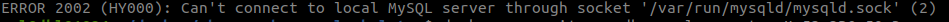

# Get started fast with your PHP and MySQL development using Docker, without messing up your local development machine

**Intro**

The purpose of this repo is to provide LAMP environment for guys and gals to start with PHP and MySQL development.

This repo will spin up 4 Docker containers.

Apache 2.4.51


PHP 8.0.12


PHP 7.4.25


MySQL 8.0.27


phpMyAdmin 5.1.1


**Folder structure**


1. apache folder contains Dockerfile and php-fpm.conf configuration to run PHP-FPM with Apache
2. asset folder stores resources like images, etc for the README.md
3. myapp folder is the initial starting place for your code. Edit the index.php according to your need.
4. mysql-config folder store settings overwrite for MySQL
5. mysql-store folder is to persist your MySQL data. This can be moved to Docker volume.


**One time setup**

1. Create work directory
```bash
mkdir myCoolProject && cd myCoolProject
``` 

2. Clone the [alpine-apache-php-mysql-skeleton repo](https://github.com/thetycoon79/alpine-apache-php-mysql-skeleton)
```bash
git clone https://github.com/thetycoon79/alpine-apache-php-mysql-skeleton.git .
```

3. Build the Docker containers
```bash
docker-compose up -d --build
```


4. Wait for it to complete. For the first time run, it will some time. This is because Docker needs to build or pull the relevant images into your local environment.


**Accessing the environment;**

1. From your browser navigate to http://localhost:8080 for PHP8


2. From your browser navigate to http://localhost:8181 for PHP7

 

3. From your browser navigate to http://localhost:8282 for phpMyAdmin


4. MySQL Workbench  
  


**Simple How to**

*Hello World*

1. Edit myapp/index.php with

```phpregexp
<?php
$date = date("Y/m/d");
$greeting = "Hello from php_apache_mysql_skeleton.{$date}";
echo $greeting;
```

2. Navigate to http://localhost:8080 or http://localhost:8181


*MySQL*

1. Edit myapp/index.php with

```phpregexp
<?php
$host = 'db-server';
$db   = 'app';
$user = 'root';
$pass = 'My53r3P@s50rD';
$charset = 'utf8mb4';

$dsn = "mysql:host=$host;dbname=$db;charset=$charset";
$options = [
    PDO::ATTR_ERRMODE            => PDO::ERRMODE_EXCEPTION,
    PDO::ATTR_DEFAULT_FETCH_MODE => PDO::FETCH_ASSOC,
    PDO::ATTR_EMULATE_PREPARES   => false,
];
try {
    $pdo = new PDO($dsn, $user, $pass, $options);
} catch (\PDOException $e) {
    throw new \PDOException($e->getMessage(), (int)$e->getCode());
}

$stmt = $pdo->query('SELECT * FROM quotes');
while ($row = $stmt->fetch())
{
    $authorQuotes = "{$row['quote']} - {$row['author']} <br/>";
    echo $authorQuotes;
}
```

2. Navigate to http://localhost:8080 or http://localhost:8181


**Docker compose command**

Start
```bash
docker-compose start
```

Stop
```bash
docker-compose stop
```

Rebuild only PHP8 Docker container
```bash
docker-compose build php-server-8
```

Rebuild only PHP7 Docker container
```bash
docker-compose build php-server-7
```

Rebuild only Apache Docker container
```bash
docker-compose build web-server
```

Rebuild only MySQL Docker container
```bash
docker-compose build db-server
```

Rebuild only phpMyAdmin Docker container
```bash
docker-compose build phpmyadmin
```

Accessing MySQL Docker container
```bash
docker exec -it app-db mysql -uroot -pMy53r3P@s50rD
```

Accessing Apache Docker logs
```bash
docker logs -f web-server
```

**Kill 'em all - this will destroy all your PHP and Apache Docker containers**
```bash
docker-compose stop && \
docker-compose down && \
docker-compose kill && \
docker rmi -f web-server:latest && \
docker rmi -f zulfadzlyrazak/php7-fpm:latest && \
docker rmi -f zulfadzlyrazak/php8-fpm:latest
```
**Start fresh - will recreate fresh build of all Apache,PHP,MySQL and phpMyAdmin Docker containers**
```bash
docker-compose up -d --force-recreate --build
```

**Known Issues**

1. ERROR 2002 (HY000): Can't connect to local MySQL server through socket '/var/run/mysqld/mysqld.sock' (2)  



Workaround : Wait for 3 minute after docker-compose up